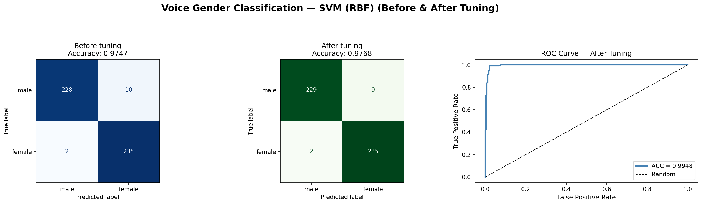
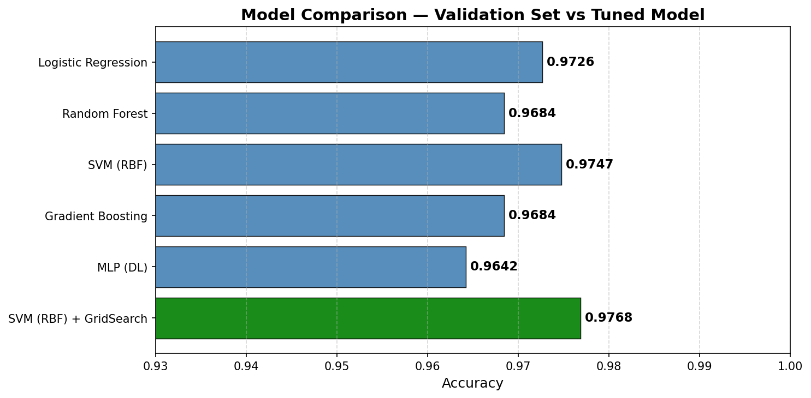

<div align="center">

<br/>

```
██████╗ ███████╗███╗   ██╗██████╗ ███████╗██████╗
██╔════╝ ██╔════╝████╗  ██║██╔══██╗██╔════╝██╔══██╗
██║  ███╗█████╗  ██╔██╗ ██║██║  ██║█████╗  ██████╔╝
██║   ██║██╔══╝  ██║╚██╗██║██║  ██║██╔══╝  ██╔══██╗
╚██████╔╝███████╗██║ ╚████║██████╔╝███████╗██║  ██║
 ╚═════╝ ╚══════╝╚═╝  ╚═══╝╚═════╝ ╚══════╝╚═╝  ╚═╝
```

# Voice-Based Gender Classification

*End-to-end ML pipeline — 3 168 voice samples → binary gender prediction*

<br/>


<br/>

| `97.68%` | `0.9948` | `5 models` | `3 168 samples` |
|:---:|:---:|:---:|:---:|
| Final accuracy | AUC-ROC | Compared | Real dataset |

<br/>

</div>

---

### `01` — Why this problem?

> Voice signals carry distinct acoustic signatures — pitch, fundamental frequency, spectral entropy, and modulation patterns all differ measurably between speakers. This project learns those patterns from raw audio features and classifies gender without any visual information.

- → Binary classification · `male` / `female`
- → Domain: Speech Processing · Biometrics · HCI
- → Fully reproducible pipeline · no data leakage
- → AI-generated synthetic dataset for stability testing

---

### `02` — Dataset

| Metric | Value |
|--------|-------|
| **Source** | [Kaggle — Voice Gender Recognition](https://www.kaggle.com/primaryobjects/voicegender) |
| **Samples** | 3 168 labeled recordings |
| **Features** | 20 acoustic measurements |
| **Balance** | 1 584 male · 1 584 female (50 / 50) |
| **Missing values** | 0 |

<details>
<summary><b>20 acoustic features →</b></summary>

<br/>

| Feature | Description |
|---------|-------------|
| `meanfreq` | Mean frequency in kHz |
| `sd` | Standard deviation of frequency |
| `median` | Median frequency |
| `Q25` / `Q75` | 1st and 3rd quartile |
| `IQR` | Interquartile range |
| `skew` | Skewness of frequency |
| `kurt` | Kurtosis |
| `sp.ent` | Spectral entropy |
| `sfm` | Spectral flatness measure |
| `mode` | Mode frequency |
| `centroid` | Frequency centroid |
| `meanfun` | Mean fundamental frequency |
| `minfun` / `maxfun` | Min / Max fundamental frequency |
| `meandom` | Mean dominant frequency |
| `mindom` / `maxdom` | Min / Max dominant frequency |
| `dfrange` | Dominant frequency range |
| `modindx` | Modulation index |

*Extracted using R `seewave` + `tuneR` — frequency range: 0.01 to 280 Hz*

</details>

---

### `03` — Pipeline

| Step | Task | Tag |
|------|------|-----|
| `01` | Dataset search — `voice.csv` from Kaggle | `D1` |
| `02` | Generative AI — CTGAN generates 500 synthetic rows | `D2` |
| `03` | Loading & preparation — explore, clean, encode | `D1` |
| `04` | Feature engineering — PCA + LDA | `D1` |
| `05` | Data splitting — Train 70% / Val 15% / Test 15% + KFold k=5 | `D1+D2` |
| `06` | Algorithm selection — LR, RF, SVM, GBM, MLP | `D1` |
| `07` | Training & comparison — best model auto-selected | `D1` |
| `08` | Final evaluation — accuracy, AUC-ROC, confusion matrix | `D1` |
| `09` | Result analysis — feature importance + stability test on D2 | `D1+D2` |
| `10` | Model enhancement — GridSearchCV on `best_model` | `D1` |

---

### `04` — Results



---

### `05` — Model Comparison

| Model | Accuracy | |
|-------|:--------:|---|
| MLP (DL) | 0.9642 | `████████████████████████████████████████` |
| Random Forest | 0.9684 | `█████████████████████████████████████████` |
| Gradient Boosting | 0.9684 | `█████████████████████████████████████████` |
| Logistic Regression | 0.9726 | `██████████████████████████████████████████` |
| SVM (RBF) | 0.9747 | `███████████████████████████████████████████` |
| **SVM (RBF) + GridSearch ★** | **0.9768** | `████████████████████████████████████████████` |

> AUC-ROC after tuning: **0.9948** — near-perfect discrimination



---

### `06` — Generative AI (CTGAN)

```python
# Step 2 — CTGAN via SDV library
from sdv.single_table import CTGANSynthesizer

ctgan = CTGANSynthesizer(metadata, epochs=300)
ctgan.fit(df_real)
df2 = ctgan.sample(num_rows=500)

# D2 used for:     cross-val + stability test
# D2 NOT used for: training  (avoids contamination)
```

---

### `07` — No Data Leakage

| Transformer | Rule |
|-------------|------|
| `StandardScaler` | fit on `X_train` only → transform val + test |
| `PCA` | fit on `X_train` only → transform val + test |
| `D2 transform` | reused D1 scaler/PCA — no refit on synthetic data |

---

### `08` — Stack

| Library | Role |
|---------|------|
| `pandas` / `numpy` | Data manipulation & numerics |
| `scikit-learn` | Models, PCA, GridSearchCV, metrics |
| `SDV` (CTGAN) | Synthetic data generation |
| `matplotlib` / `seaborn` | Visualization & plots |
| `Jupyter` | Notebook environment |
| `Python 3.13` | Core language |

---

### `09` — Run it

```bash
# Install
pip install pandas numpy scikit-learn sdv matplotlib seaborn jupyter

# Launch
jupyter notebook notebook.ipynb

# Note: Step 2 (CTGAN) takes ~3–5 min on CPU — 300 epochs
# Steps 3–10 run in seconds
```

---

### `10` — Repository Structure

```
gender-classification-ai/
│
├── 📓 notebook.ipynb              # Full pipeline — 10 steps
│
├── 📂 data/
│   ├── voice.csv                  # Original dataset (Kaggle)
│   └── voice_synthetic.csv        # CTGAN-generated dataset (D2)
│
├── 📊 outputs/
│   ├── evaluation_plots.png                  
│   └── model_comparison_zoomed.png
│   └── model_evaluation_enhanced.png          # Confusion matrix + ROC + model comparison
│
├── requirements.txt
├── README.md
└── LICENSE
```

---

### `11` — Author

**Afaf Kenanda** —  🎓 University TAHRI Mohammed — Bechar · AI Techniques & Tools · Subject #16

---

<div align="center">

`Dataset` CC BY-NC-SA 4.0 &nbsp;·&nbsp; `Code` MIT &nbsp;·&nbsp; [Kaggle Dataset](https://www.kaggle.com/primaryobjects/voicegender) &nbsp;·&nbsp; [SDV Docs](https://sdv.dev)

</div>
